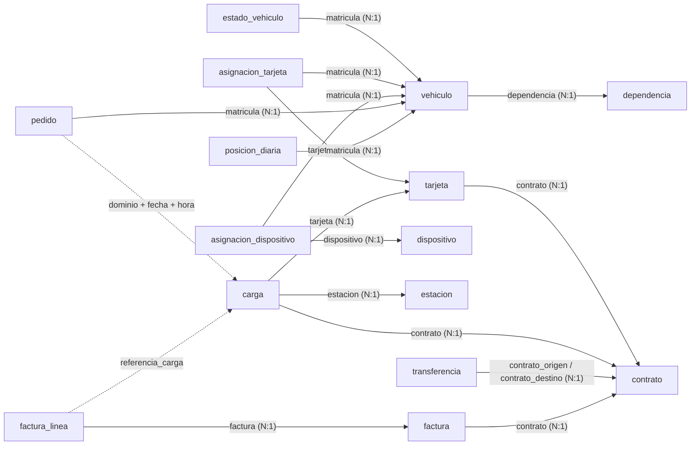

# Base de datos

Base SQLite del escenario realista: datos maestros con vigencia, datos operativos y vistas de control. No cambia los datos ni las hipótesis (las reglas y los modelos siguen leyendo los CSV); ordena el modelo de datos, hace verificable la integridad y deja los controles escritos en SQL.

## Para qué sirve

- **Integridad verificable.** Las relaciones entre tablas son claves foráneas y restricciones: toda carga es de una tarjeta y un contrato que existen, toda línea pertenece a una factura, ninguna transferencia va de un contrato a sí mismo. Si el generador o una fuente las rompe, la carga falla.
- **Vigencias.** Tarjetas y dispositivos se asignan a un vehículo (o a una persona) desde una fecha hasta otra, y el estado de cada vehículo tiene su historia. Responde preguntas como "¿de quién era esta tarjeta el día de la carga?".
- **Carga diaria.** Se puede cargar hasta una fecha y después seguir: cada fila se inserta o se actualiza por su clave, así que cargar dos veces no duplica nada. Cada carga queda registrada (`carga_de_datos`).
- **Controles portables.** Los controles de H9, H10 y H11 están escritos como vistas con SQL estándar (ventanas y CTE), que corren en otros motores.

## Uso

```bash
python -m base_datos cargar                      # crea datasets/auditoria_realista.db y carga el dataset realista
python -m base_datos cargar --hasta 2024-04-30   # carga diaria: solo hasta esa fecha
python -m base_datos verificar                   # integridad referencial y filas por tabla
```

La base es un archivo local, que se puede recrear en cualquier momento desde los CSV: `datasets/` está fuera de Git y no se versiona ninguna base. Los tests usan una base temporal.

## Esquema



| Grupo | Tablas |
|---|---|
| Maestros (con vigencia) | `contrato`, `dependencia`, `vehiculo`, `estado_vehiculo`, `tarjeta`, `asignacion_tarjeta`, `estacion`, `dispositivo`, `asignacion_dispositivo` |
| Operativos (se cargan por día) | `carga` (reporte del proveedor), `pedido` (registro interno), `transferencia`, `factura`, `factura_linea`, `posicion_diaria` |
| Control | `migracion` (versiones aplicadas), `carga_de_datos` (cada carga: origen, fecha tope, semilla, filas por tabla) |

Dos relaciones no son claves foráneas a propósito (flechas punteadas): el registro interno no comparte ninguna clave con el reporte del proveedor (se cruza por dominio y horario), y una línea de factura que referencia una carga inexistente es justamente lo que se audita.

## Migraciones

| Versión | Contenido |
|---|---|
| 001 | Maestros |
| 002 | Operativos e índices |
| 003 | Vistas de control |
| 004 | Registro de cargas |

Cada migración declara su compatibilidad, el bloqueo esperado, cómo volver atrás y cómo verificarla, y se aplica una sola vez, en su propia transacción (`base_datos/esquema.py`).

## Vistas de control

| Vista | Qué muestra | Hipótesis |
|---|---|---|
| `saldo_diario_contrato` | Saldo de cada contrato por día: tope, transferencias y consumo, reiniciado cada mes | H10 |
| `cargas_con_saldo_agotado` | Contratos-mes con días que empiezan sin saldo y tienen cargas | H10 |
| `conciliacion_factura` | Conciliación triple: deuda contra líneas, PDF contra deuda y renglones que no son combustible | H9 |
| `linea_sin_carga` | Líneas de combustible que facturan una carga que no está en el reporte | H9 |
| `baja_con_dispositivo_activo` | Móviles de baja con el dispositivo fuera del depósito y transmitiendo | H11 |

Los tests verifican que cada vista encuentre exactamente las anomalías inyectadas de su tipo.

## Propuesta de mejora para la fuente real

La estructura de la base del sistema en uso (ver el perfil en [perfiles/](../perfiles/README.md)) muestra tres puntos que este esquema resuelve:

| En la fuente | En este esquema |
|---|---|
| El consumo se guarda como un bloque JSON por día (`data_json`), sin una fila por carga | Una fila por carga, con claves hacia tarjeta, contrato y estación: se puede consultar, sumar y cruzar sin reprocesar archivos |
| La tabla de crédito por contrato existe pero está vacía: las transferencias de saldo no quedan registradas | `transferencia` registra cada movimiento; `saldo_diario_contrato` reconstruye el saldo y permite auditar si cada transferencia era necesaria |
| El registro interno y el reporte del proveedor no comparten ninguna clave | Se cruzan igual (por dominio o persona y horario), pero el esquema deja lugar para guardar el ticket o el remito en ambos lados, lo que volvería el cruce exacto |

## Limitaciones

- Solo el escenario realista (el didáctico no tiene contratos, registro interno ni facturación por contrato).
- Las vigencias se cargan como las da el generador: una asignación por tarjeta y dispositivo y, por vehículo, a lo sumo un cambio de estado en el período.
- SQLite es suficiente para esta escala; para un sistema en producción, el mismo esquema y las mismas vistas se trasladan a un motor servidor.
