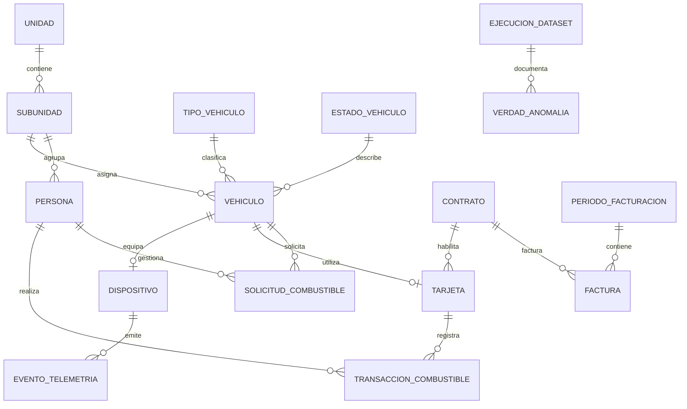

# Modelo de datos sintéticos

## Estado y propósito

Este documento define el **modelo objetivo inicial** que el equipo utilizará para conversar, diseñar el generador y preparar el análisis. Describe estructura y relaciones, no datos observados. La estructura física se ajustará cuando exista un perfil de metadatos aprobado, sin trasladar filas ni valores reales.

## Dominios

| Dominio | Entidades principales | Propósito |
|---|---|---|
| Organización ficticia | `unidad`, `subunidad` | Contexto jerárquico de asignación |
| Flota | `vehiculo`, `tipo_vehiculo`, `estado_vehiculo` | Maestro de activos y estado operativo |
| Telemetría | `dispositivo`, `evento_telemetria` | Cobertura, posición, actividad y odómetro |
| Personas sintéticas | `persona` | Responsabilidades o asignaciones ficticias |
| Combustible | `contrato`, `tarjeta`, `transaccion_combustible` | Compras, litros, importes y vinculaciones |
| Facturación | `periodo_facturacion`, `factura` | Conciliación de consumos e importes |
| Operación | `solicitud_combustible` | Solicitudes, estados y rendición |
| Trazabilidad sintética | `ejecucion_dataset`, `verdad_anomalia` | Reproducibilidad y evaluación |

## Diagrama conceptual

## Claves y convenciones

- Las claves internas serán UUID o enteros generados, sin semántica externa.
- Los identificadores visibles usarán prefijos sintéticos: `VEH-SYN-`, `PER-SYN-`, `DEV-SYN-`, `CARD-SYN-` y `CTR-SYN-`.
- Los dominios visibles no seguirán formatos oficiales de matrículas o documentos personales.
- Las fechas se almacenarán en ISO 8601 y los instantes en UTC.
- Importes y volúmenes usarán tipos decimales; no `float` binario en persistencia.
- Las relaciones rotas solo aparecerán en datasets crudos de escenarios que las inyecten. El modelo curado mantendrá integridad referencial.

## Grano de las tablas de hechos

| Entidad | Una fila representa |
|---|---|
| `evento_telemetria` | Una observación de un dispositivo en un instante |
| `transaccion_combustible` | Una operación sintética de carga |
| `factura` | Un comprobante sintético de un contrato y período |
| `solicitud_combustible` | Una solicitud operativa y su estado |
| `verdad_anomalia` | Una alteración deliberada aplicada a un registro |

## Capas

- **Raw:** conserva los defectos inyectados y representaciones heterogéneas.
- **Standardized:** normaliza nombres, tipos, fechas y categorías.
- **Curated:** integra entidades y agrega indicadores analíticos.
- **Ground truth:** registra anomalías sin quedar disponible para entrenamiento o inferencia, salvo en la evaluación autorizada.

## Decisiones pendientes

El motor, nombres físicos definitivos, índices y particionamiento se definirán después del perfil de metadatos y del volumen sintético objetivo. Este documento no autoriza crear ni migrar bases.
