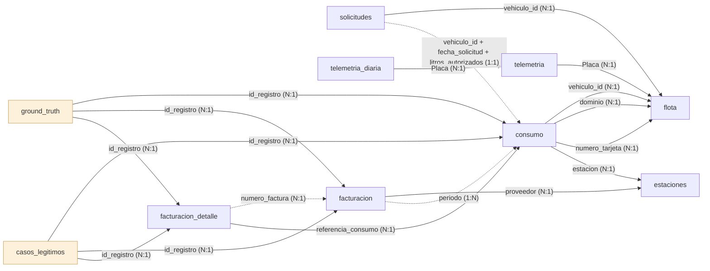

# Diccionario de datos — Pipeline maestro

Describe los archivos que genera [`generator_pipeline_maestro.py`](../generator_pipeline_maestro.py), el generador oficial. Todos los datos son sintéticos. Los valores de referencia corresponden a la configuración por defecto (200 vehículos, semilla 42).

Hay dos escenarios. Las secciones siguientes describen el **didáctico** (`--escenario didactico`, el predeterminado del generador); el **realista** tiene su propia sección [al final](#escenario-realista).

```bash
python generator_pipeline_maestro.py                  # datasets/synthetics_maestro/
python generator_pipeline_maestro.py --n_flota 500 --seed 7 --output otra/carpeta
```

| Archivo | Grano | Filas (por defecto) |
|---|---|---|
| `flota.csv` | un vehículo | 200 |
| `telemetria.csv` | un dispositivo GPS | 176 (88% de la flota) |
| `consumo.csv` | una carga de combustible | ~1.770 (5 a 12 por vehículo, más duplicados) |
| `solicitudes.csv` | una solicitud de combustible | ~500 (1 a 4 por vehículo) |
| `facturacion.csv` | una factura mensual de toda la flota | 9 (enero a septiembre de 2024) |
| `ground_truth.csv` | una anomalía inyectada | ~230 |
| `metadata.json` | una ejecución | semilla, parámetros, rutas y conteo de anomalías por tipo |

## Reproducibilidad

- La misma semilla produce archivos idénticos byte a byte (lo verifican los tests).
- Las fechas se calculan desde valores fijos: consumos y solicitudes entre el 2024-01-01 y el 2024-09-27, y la telemetría toma como "ahora" el 2024-09-28.
- Solo `metadata.json` cambia entre ejecuciones, porque registra la fecha de generación.

## Claves y relaciones

El generador escribe, junto a los datos, un **`diccionario.json`** con el grano, la clave, las columnas (tipo y descripción) y las relaciones del escenario generado. Es la fuente de verdad de este documento: un test verifica que describa exactamente las columnas de cada archivo, en su orden. La app lo muestra en la página **Datasets**.

Diagrama del escenario realista. Las flechas punteadas no son claves: se resuelven por emparejamiento o por agregación. En naranja, las tablas de evaluación, que no son entradas de las reglas ni de los modelos. El escenario didáctico usa el subconjunto de `flota`, `telemetria`, `consumo`, `solicitudes`, `facturacion` y `ground_truth`.



| Tabla | Columna | Se relaciona con | Cardinalidad | Escenarios | Nota |
|---|---|---|---|---|---|
| `consumo` | `vehiculo_id` | `flota` (`Matricula`) | N:1 | ambos | — |
| `consumo` | `dominio` | `flota` (`Dominio`) | N:1 | ambos | se rompe en DOMINIO_INVALIDO |
| `consumo` | `numero_tarjeta` | `flota` (`NumeroTarjeta`) | N:1 | ambos | — |
| `consumo` | `estacion` | `estaciones` (`codigo`) | N:1 | realista | — |
| `solicitudes` | `vehiculo_id` | `flota` (`Matricula`) | N:1 | ambos | — |
| `solicitudes` | `vehiculo_id + fecha_solicitud + litros_autorizados` | `consumo` (`vehiculo_id + fecha + litros`) | 1:1 | realista | sin clave: se empareja por vehículo, fecha y litros |
| `telemetria` | `Placa` | `flota` (`Dominio`) | N:1 | ambos | uno por vehículo en el realista |
| `telemetria_diaria` | `Placa` | `telemetria` (`Placa`) | N:1 | realista | — |
| `facturacion` | `proveedor` | `estaciones` (`marca`) | N:1 | realista | — |
| `facturacion_detalle` | `numero_factura` | `facturacion` (`numero_factura`) | N:1 | realista | la suma de las líneas es el total (salvo TOTAL_INFLADO) |
| `facturacion_detalle` | `referencia_consumo` | `consumo` (`id`) | N:1 | realista | se rompe en LINEA_SIN_CONSUMO; dos líneas en LINEA_DUPLICADA |
| `ground_truth` | `id_registro` | `consumo / facturacion / facturacion_detalle` (`id`) | N:1 | ambos | según la columna tabla |
| `casos_legitimos` | `id_registro` | `consumo / facturacion / facturacion_detalle` (`id`) | N:1 | realista | según la columna tabla |
| `facturacion` | `periodo` | `consumo` (`fecha (mes)`) | 1:N | didáctico | suma de las cargas del mes |

En el escenario didáctico, `ground_truth` solo referencia cargas (`consumo`).

### Tablas maestras y de detalle

Algunas tablas describen la misma entidad con distinto grano; no son duplicados:

- `telemetria` (un dispositivo: IMEI, línea, estado) y `telemetria_diaria` (un dispositivo por día: km y recorrido).
- `facturacion` (una factura: proveedor, período, total, estado) y `facturacion_detalle` (una línea: qué carga factura, litros, precio).

Hay datos que podrían calcularse desde otra tabla y se guardan igual, porque su diferencia es lo que se audita: el total de la factura frente a la suma de sus líneas (H9), el dominio de la carga frente al del vehículo (H1), el odómetro frente a los km del GPS (H2c y H5), el precio facturado frente al de la carga (H9).

## flota.csv

| Columna | Tipo | Descripción |
|---|---|---|
| `Matricula` | texto | Clave del vehículo, `VEH-NNNNNN` |
| `Dominio` | texto | Dominio sintético `ABNNNNCD`, único; no proviene de un padrón |
| `Estado` | categoría | EN SERVICIO, EN REPARACION, FUERA DE SERVICIO o BAJA |
| `DireccionGral` | categoría | Dirección ficticia a la que pertenece el vehículo (5 valores) |
| `Dependencia` | categoría | Dependencia ficticia dentro de la dirección, `DEP A` a `DEP J` |
| `Identificable` | SI / NO | 94% SI |
| `TipoVehiculo` | categoría | SEDAN, PICK-UP, MOTOCICLETA, CAMIONETA, CAMION, AMBULANCIA, UTILITARIO o BOMBERO |
| `Marca` | categoría | Marca de un catálogo público general |
| `Modelo` | texto | `MODEL-AAAA`, genérico |
| `Año` | entero | 2005 a 2024 |
| `TipoCombustible` | categoría | GASOIL, NAFTA o GLP |
| `CapacidadTanque` | decimal (L) | 40 a 120 |
| `NumeroMotor` / `NumeroChasis` | texto | `M` y `CH` más 8 dígitos |
| `NumeroTarjeta` | texto | Tarjeta de combustible, `TARJ` más 8 dígitos |
| `LimiteSaldo` | decimal | 1.000 a 10.000 |
| `LimiteLitros` | decimal (L) | 100 a 500 |
| `SubEstado` | categoría | ACTIVO si `Estado` es EN SERVICIO; si no, INACTIVO |

## telemetria.csv

| Columna | Tipo | Descripción |
|---|---|---|
| `IMEI` | entero | 15 dígitos, aleatorio |
| `Alias` | texto | `DEV-NNNNNN` |
| `Placa` | texto | Dominio de un vehículo de la flota (un vehículo puede tener varios dispositivos) |
| `MSISDN` | entero | Línea sintética `54911` más 7 dígitos |
| `Modelo` | texto | `GPS-{A,B,C}-{1..5}` |
| `Tipo` | texto | Siempre GPS |
| `Estado` | categoría | ONLINE (88%) u OFFLINE |
| `Bateria` | decimal (%) | 20 a 100 |
| `UltimaConexion` | fecha y hora | Hasta 15 minutos antes de la referencia si está ONLINE; hasta 10 horas si está OFFLINE |
| `Latitud` / `Longitud` | decimal | Rectángulo aproximado de un área metropolitana |
| `Odometro` | entero (km) | 10.000 a 300.000, independiente del odómetro de consumo |

## consumo.csv

| Columna | Tipo | Descripción |
|---|---|---|
| `id` | texto | Clave de la transacción, `CONS-NNNNNNNN` |
| `vehiculo_id` | texto | FK a `flota.Matricula` |
| `dominio` | texto | Dominio informado en la carga; puede no coincidir con la flota |
| `fecha` | fecha | Fecha de la carga |
| `estacion` | categoría | Estación de servicio (5 valores); puede estar vacía |
| `producto` | categoría | GASOIL, NAFTA, INFINIA, SUPER o GLP |
| `litros` | decimal (L) | Normal: de 5 L al 80% del tanque (tope 80 L). Exceso: 110% a 180% del tanque |
| `precio_unitario` | decimal | 1,5 a 3,5 |
| `importe_total` | decimal | `litros × precio_unitario`, redondeado |
| `numero_tarjeta` | texto | Tarjeta del vehículo |
| `conductor` | texto | `CONDUCTOR-N`; puede estar vacío |
| `odometro` | entero (km) | Crece según los días entre cargas (20 a 60 km por día, propio de cada vehículo); puede estar vacío |

## solicitudes.csv

| Columna | Tipo | Descripción |
|---|---|---|
| `id` | texto | `SOL-NNNNNNNN` |
| `vehiculo_id` / `dominio` | texto | Vehículo solicitante (siempre válido) |
| `fecha_solicitud` | fecha | Dentro de la misma ventana que el consumo |
| `litros_solicitados` / `litros_autorizados` | decimal (L) | 20 a 100, generados por separado |
| `estado` | categoría | APROBADA (50%), PENDIENTE o RECHAZADA |
| `centro_costo` | texto | `CC-NNN` |
| `responsable` | texto | `RESP-N` |
| `observaciones` | categoría | OK, REVISADO, PENDIENTE o vacío (el vacío es un valor posible, no una anomalía) |

## facturacion.csv

| Columna | Tipo | Descripción |
|---|---|---|
| `numero_factura` | texto | `FAC-AAAAMM-NNNN` |
| `fecha_factura` | fecha | Último día del período |
| `periodo` | texto | `AAAA-MM` |
| `total_litros` / `total_monto` | decimal | Suma del consumo del período |
| `iva` | decimal | 21% de `total_monto` |
| `monto_total_con_iva` | decimal | `total_monto × 1,21` |
| `estado` | categoría | PAGADA, PENDIENTE o VENCIDA |
| `numero_transacciones` | entero | Cantidad de cargas del período |

## ground_truth.csv

Verdad de referencia: una fila por anomalía inyectada. **Se usa solo para evaluar la detección; no es una entrada de las reglas ni de los modelos.** Un registro puede tener más de una anomalía (por ejemplo, un duplicado de una carga con exceso).

| Columna | Descripción |
|---|---|
| `tabla` | Tabla afectada (hoy, siempre `consumo`) |
| `id_registro` | `consumo.id` de la transacción |
| `vehiculo_id` | Vehículo de la transacción |
| `tipo_anomalia` | Ver el catálogo |
| `columna` | Columna donde se manifiesta |
| `hipotesis` / `severidad` | Según el catálogo |
| `descripcion` | Detalle legible, por ejemplo `retroceso de 12000 km` |

### Catálogo de anomalías

| Tipo | Hipótesis | Severidad | Tasa | Cómo se inyecta |
|---|---|---|---|---|
| `EXCESO_VOLUMETRICO` | H3a | ALTA | 7% de los vehículos | Todas las cargas del vehículo superan la capacidad del tanque |
| `ODOMETRO_REGRESIVO` | H2 | ALTA | 1,2% de las cargas | El odómetro retrocede entre 3.000 y 40.000 km y las cargas siguientes continúan desde ese valor |
| `ODOMETRO_SALTO` | H2 | ALTA | 1,2% de las cargas | El odómetro avanza entre 1.500 y 9.000 km extra y las cargas siguientes continúan desde ese valor |
| `DOMINIO_INVALIDO` | H1 | MEDIA | 1% de las cargas | El dominio se reemplaza por `XXNNNXX`, sin vínculo con la flota |
| `VALOR_NULO` | CALIDAD | BAJA | 2% de las cargas | Se vacía `estacion`, `conductor` u `odometro` (nunca un odómetro alterado) |
| `DUPLICADO` | CALIDAD | MEDIA | 1% de las cargas | Copia exacta de otra carga con un `id` nuevo; hereda sus anomalías de valor, no las de odómetro |

## Limitaciones conocidas

Las siguientes incoherencias **no son anomalías inyectadas** y no figuran en el ground truth:

- `litros_autorizados` puede superar a `litros_solicitados`, porque ambos se generan por separado.
- El odómetro de telemetría no se relaciona con el de consumo.
- Hay una sola factura por mes para toda la flota; no se inyectan anomalías de facturación.
- La telemetría siempre apunta a dominios válidos, así que la vinculación de dispositivos (H1) es del 100%. En el escenario realista, el 2% de las cargas trae el dominio con otro formato (ver *Formatos de origen*).

## Escenario realista

```bash
python generator_pipeline_maestro.py --escenario realista   # datasets/synthetics_realista/
```

Cada vehículo se simula día por día desde un perfil propio que no forma parte de los datos: rendimiento (km/L), km por día hábil, zona de operación y nivel de tanque al que carga. Recorre km (un 25% de los días no se usa), consume según su rendimiento y carga cuando el tanque baja de su umbral, en una estación cercana. Así litros, odómetro y GPS son coherentes entre sí; sobre ese uso se inyectan las anomalías y los casos legítimos que se les parecen.

| Archivo | Grano | Filas (por defecto) |
|---|---|---|
| `flota.csv` | un vehículo | 200 |
| `estaciones.csv` | una estación de servicio | 65 (40 en la zona de operación, 25 sobre rutas) |
| `telemetria.csv` | un dispositivo GPS | ~100 (80% de los vehículos en servicio, 47% de los fuera de servicio, casi ninguno de baja) |
| `telemetria_diaria.csv` | un dispositivo y un día | ~26.000 (3% de los días sin señal) |
| `consumo.csv` | una carga de combustible | ~3.400 (los vehículos fuera de servicio o de baja dejan de cargar) |
| `solicitudes.csv` | una solicitud de combustible | ~3.700 (una por carga, más rechazadas y pendientes) |
| `facturacion.csv` | una factura mensual de un proveedor | 45 (5 proveedores × 9 meses) |
| `facturacion_detalle.csv` | una línea de factura | ~3.400 (una por carga facturada, más ajustes) |
| `contratos.csv` | un contrato de abastecimiento | 6, con su tope mensual en pesos |
| `transferencias.csv` | una transferencia de saldo entre contratos | ~50 (unas 5 por mes) |
| `ground_truth.csv` | una anomalía inyectada | ~125 |
| `casos_legitimos.csv` | un caso legítimo que parece anomalía | ~200 |

### Diferencias con el escenario didáctico

| Tabla | Columna | En el escenario realista |
|---|---|---|
| flota | `Estado` | Calibrado con la fuente: 51,5% EN SERVICIO, 12,7% FUERA DE SERVICIO, 35,8% TRAMITE EN BAJA. De los que no están en servicio, parte cambió de estado durante el período (40% de los fuera de servicio, 15% de los de baja) y el resto ya estaba así antes y no carga |
| flota | `SubEstado` | Motivo de fuera de servicio (problema de motor, batería, siniestro…) o etapa del trámite de baja; vacío si está en servicio |
| flota | `Dominio` | Formatos públicos marcados como sintéticos (empiezan con Z, serie no asignada): autos desde 2016 `ZA123BC`, anteriores `ZZA123`, motos `Z123ABC` |
| flota | `TipoVehiculo` / `Marca` | 37% sedán, 36% pick-up, 25% moto, 1% utilitario, 1% camión; marcas según el tipo |
| flota | `Año` / `Identificable` | Año con moda en 2020 (mediana ~2018); 80% identificables |
| flota | `CapacidadTanque` | Según el tipo: moto 10–18 L, sedán 45–60, pick-up 70–80, utilitario 55–70, camión 150–300 |
| flota | `TipoCombustible` | Motos NAFTA; sedanes 80% NAFTA; pick-ups 80% GASOIL; utilitarios y camiones GASOIL (62% NAFTA en total) |
| flota | `LimiteLitros` | 3 a 6 tanques |
| flota | `FechaEstado` (nueva) | Fecha del último cambio a un estado distinto de EN SERVICIO; vacía si está en servicio. El vehículo deja de usarse desde esa fecha |
| consumo | `estacion` | Código de `estaciones.csv` (`EST-NNN`) |
| consumo | `producto` | 99% premium: INFINIA DIESEL o INFINIA; el resto GASOIL o SUPER |
| consumo | `precio_unitario` | Precio base del producto con un aumento del 2% mensual |
| consumo | `litros` / `odometro` | Resultan de la simulación: el odómetro avanza según los km recorridos y los litros reponen lo consumido |
| telemetria | `Odometro` | km acumulados del vehículo al final del período |
| solicitudes | todas | Coherentes con las cargas: cada carga tiene una solicitud APROBADA del mismo vehículo 0 a 2 días antes, por el 100% al 125% de los litros cargados. Además, un 8% de solicitudes RECHAZADA o PENDIENTE que no terminan en carga (`litros_autorizados` = 0) |
| facturacion | `proveedor` (nueva) | Marca de la estación: cada proveedor emite una factura por mes |
| facturacion | `total_monto` | Suma de las líneas de la factura (salvo en las anomalías `TOTAL_INFLADO`) |

### estaciones.csv

| Columna | Descripción |
|---|---|
| `codigo` | `EST-NNN` |
| `marca` | Una de cinco marcas de estación |
| `ubicacion` | LOCAL (zona de operación) o RUTA (sobre una de 5 rutas de 250 a 700 km) |
| `latitud` / `longitud` | Coordenadas |

### telemetria_diaria.csv

| Columna | Descripción |
|---|---|
| `Placa` | Dominio del vehículo |
| `fecha` | Día |
| `km_gps` | km recorridos ese día según el GPS (±3% de los reales; 0 si no se movió) |
| `lat_inicio` / `lon_inicio` / `lat_fin` / `lon_fin` | Posición al empezar y al terminar el recorrido del día |

### facturacion_detalle.csv

Detalle de cada factura: una línea por carga facturada, más las líneas de ajuste.

| Columna | Descripción |
|---|---|
| `numero_linea` | `LIN-NNNNNNNN` |
| `numero_factura` | Factura a la que pertenece |
| `referencia_consumo` | `consumo.id` de la carga facturada; vacía en los ajustes |
| `concepto` | COMBUSTIBLE o AJUSTE |
| `fecha` / `dominio` / `litros` | Datos de la carga según el proveedor |
| `precio_unitario` / `importe` | Precio por litro e importe facturados |
| `descripcion` | Motivo del ajuste (bonificación o recargo) |

Las solicitudes no traen el número de carga: para cruzarlas hay que emparejarlas por vehículo, fecha y litros.

### casos_legitimos.csv

Cargas que una regla ingenua marcaría como anomalía pero no lo son. No están en el ground truth; sirven para medir cuántas falsas alarmas produce cada regla.

| Columna | Descripción |
|---|---|
| `tabla` / `id_registro` / `vehiculo_id` | Carga afectada |
| `tipo_caso` | Ver el catálogo |
| `descripcion` | Detalle legible |

| Tipo de caso | Casos por cada 200 vehículos | Qué ocurre |
|---|---|---|
| `TANQUE_AUXILIAR` | 3 vehículos (todas sus cargas) | El vehículo tiene un 30% a 60% más de capacidad que la registrada y carga por encima del tanque desde el principio |
| `VIAJE_LARGO` | 4 vehículos | Un viaje de ida y vuelta por una ruta; carga en estaciones de ruta, lejos de su zona |
| `CAMBIO_ODOMETRO` | 2 vehículos | El odómetro se reemplaza y vuelve a contar desde 0 a 3.000 km |
| `ERROR_TIPEO_ODOMETRO` | 5 vehículos | Una lectura con dos dígitos intercambiados (difiere ≥1.000 km); las siguientes son correctas |
| `REGULARIZACION_POSTERIOR` | 8 cargas | La solicitud se aprueba 1 a 3 días después de la carga (una urgencia regularizada) |
| `TOLERANCIA_MEDICION` | 10 cargas | La carga supera lo autorizado entre 1% y 3%, dentro de la tolerancia del surtidor |
| `DESFASE_DE_CORTE` | 50% de las cargas del último día de cada mes (línea de factura) | Se facturan en la factura del mes siguiente |
| `AJUSTE_DOCUMENTADO` | 4 facturas | La factura incluye una línea AJUSTE (bonificación o recargo de 2% a 5%) |
| `DOMINIO_CON_FORMATO` | 0,5% de las cargas | El dominio llega en minúsculas, con espacios o guiones, o con un espacio al final (`za123bc`, `ZA 123 BC`, `ZA-123-BC`); normalizado es el del vehículo |
| `TRANSFERENCIA_DE_SALDO` | ~25 contratos-mes (`tabla` = contrato_mes) | El contrato recibió saldo porque la proyección del mes no alcanzaba |

La columna `tabla` indica a qué tabla pertenece `id_registro`: `consumo`, `facturacion` o `facturacion_detalle`.

### Catálogo de anomalías del escenario realista

Incluye las del escenario didáctico, con otra forma de inyección, y cinco tipos nuevos. Cada vehículo protagoniza a lo sumo una anomalía o un caso legítimo, para que cada alerta sea atribuible. La prevalencia de anomalías de comportamiento es cercana al 1% de las cargas.

| Tipo | Hipótesis | Casos por cada 200 vehículos | Cómo se inyecta |
|---|---|---|---|
| `EXCESO_VOLUMETRICO` | H3a / H3b | 2 vehículos | Desde un día entre el 90 y el 200, el 30% de sus cargas supera el tanque (105% a 140%) |
| `FRACCIONAMIENTO` | H4 | 6 vehículos, un día cada uno | 1 o 2 cargas extra el mismo día en otras estaciones (40% a 70% del tanque); entre todas superan el tanque. Se etiquetan todas las cargas de ese día |
| `RENDIMIENTO_IMPOSIBLE` | H5 | 2 vehículos | De 3 a 6 cargas del 80% al 95% del tanque cuando el tanque está casi lleno y sin recorrido que lo justifique |
| `CARGA_VEHICULO_INACTIVO` | H6 | 3 vehículos | De 1 a 3 cargas posteriores a su `FechaEstado` |
| `CARGA_FUERA_DE_ZONA` | H7 | 6 vehículos con GPS | Una carga en una estación a más de 100 km de su zona mientras el GPS lo ubica en ella |
| `ODOMETRO_REGRESIVO` | H2 | 3 vehículos | La lectura queda de 3.000 a 40.000 km por debajo de la anterior; las siguientes continúan desde ahí |
| `ODOMETRO_REGRESIVO_LEVE` | H2 | 4 vehículos | Igual, pero de 50 a 200 km |
| `ODOMETRO_SALTO` | H2 | 3 vehículos | La lectura suma de 1.500 a 9.000 km que el GPS no registra; las siguientes continúan desde ahí |
| `DOMINIO_INVALIDO` / `VALOR_NULO` / `DUPLICADO` | H1 / CALIDAD | 0,3% / 0,5% / 0,3% de las cargas | Como en el escenario didáctico, solo sobre cargas sin otra anomalía ni caso legítimo |
| `CARGA_SIN_SOLICITUD` | H8 | 6 cargas | La carga no tiene ninguna solicitud del vehículo |
| `CARGA_CON_SOLICITUD_RECHAZADA` | H8 | 4 cargas | La única solicitud cercana fue rechazada |
| `CARGA_SUPERA_AUTORIZADO` | H8 | 6 cargas | Se cargó entre 15% y 50% más de lo autorizado |
| `TOTAL_INFLADO` | H9 | 2 facturas (`tabla` = facturacion) | El total supera en 3% a 10% la suma de sus líneas |
| `LINEA_SIN_CONSUMO` | H9 | 6 líneas (`tabla` = facturacion_detalle) | Se factura una carga que no existe en el registro |
| `LINEA_DUPLICADA` | H9 | 5 líneas | Una carga se factura dos veces |
| `SOBREPRECIO` | H9 | 6 líneas | El precio por litro facturado supera en 8% a 20% el de la carga |
| `CARGA_CON_CUPO_AGOTADO` | H10 | 1 contrato-mes (`tabla` = contrato_mes, id `CTO-N|AAAA-MM`) | Nadie revisa el saldo de un contrato ajustado: sus transferencias del mes llegan de 1 a 3 días después de que se agota, y esos días se carga igual |
| `TRANSFERENCIA_SIN_NECESIDAD` | H10 | 2 contratos-mes | Transferencia a principio de mes a un contrato con holgura, que la proyección no justificaba |

### Contratos, cupo y transferencias (escenario realista)

Cada tarjeta pertenece a uno de seis contratos (`flota.NumeroContrato`, `consumo.contrato`). Los vehículos se reparten como el consumo de la fuente (49%, 24%, 9%, 8%, 7,5% y 2%) y cada contrato tiene un tope mensual en pesos: el consumo de su mes de mayor uso por un factor (0,9 en los dos grandes, que quedan cortos; 1,2 a 1,3 en los demás). La ejecución media del cupo total es cercana al 90%. Cada carga descuenta del saldo del mes.

Los lunes y jueves, desde el quinto día del mes, se proyecta el consumo a fin de mes (promedio del mes combinado con el histórico del contrato). Si la proyección supera el saldo en un 5%, se transfiere la diferencia con holgura desde el contrato al que más le sobra, que conserva un 20% por encima de su propia proyección. Si un día no alcanzara, se transfiere en el momento. Las transferencias se acreditan antes de las cargas del día.

La fuente real prevé una tabla de crédito por contrato pero no tiene transferencias registradas: la frecuencia y el margen son supuestos de este diseño. Las anomalías y los casos legítimos de H10 se evalúan por contrato y mes (`tabla` = contrato_mes).

`flota.Cupo` son los litros por carga de la tarjeta (la capacidad del tanque); `LimiteLitros` y `LimiteSaldo`, los límites mensuales de la tarjeta, fijados al registrarla.

### Formatos de origen del escenario realista

No son anomalías: es cómo llegan los datos de cada fuente. Se aplican al final de la generación con un generador aleatorio propio, así el resto del escenario no cambia.

- **Dominios con otro formato** en `consumo` (2% de las cargas, caso legítimo `DOMINIO_CON_FORMATO`). La vinculación exacta los confunde con dominios inválidos; normalizados (mayúsculas, sin espacios, guiones ni puntos) vinculan con su vehículo. Es lo que contrasta H1.
- **Fechas en dos formatos** en `solicitudes.fecha_solicitud`: el 85% en `AAAA-MM-DD` y el 15% en `DD/MM/AAAA`. Hay que interpretar cada formato por separado (`deteccion.reglas.leer_fecha`): con un único formato inferido, una fecha como `05/03/2024` puede leerse como 3 de mayo.

