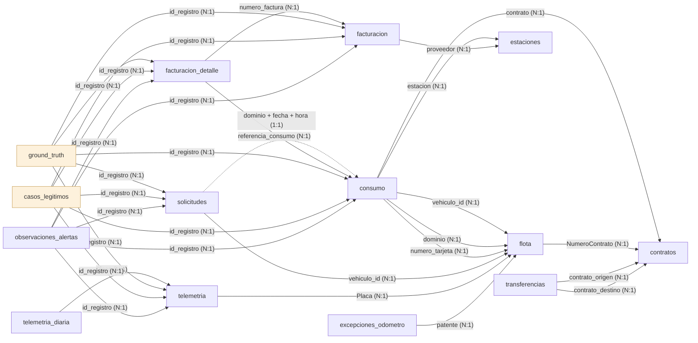

# Diccionario de datos — Pipeline maestro

Describe los archivos que genera [`generator_pipeline_maestro.py`](../generator_pipeline_maestro.py), el generador oficial. Todos los datos son sintéticos. Los valores de referencia corresponden a la configuración por defecto (200 vehículos, semilla 42).

Hay dos escenarios. Las secciones siguientes describen el **didáctico** (`--escenario didactico`, el predeterminado del generador); el **realista** tiene su propia sección [al final](#escenario-realista).

```bash
python generator_pipeline_maestro.py                  # datasets/synthetics_maestro/
python generator_pipeline_maestro.py --n_flota 500 --seed 7 --output otra/carpeta
```

| Archivo | Grano | Filas (por defecto) |
|---|---|---|
| `flota.csv` | un vehículo | 200 |
| `telemetria.csv` | un dispositivo GPS | 176 (88% de la flota) |
| `consumo.csv` | una carga de combustible | ~1.770 (5 a 12 por vehículo, más duplicados) |
| `solicitudes.csv` | una solicitud de combustible | ~500 (1 a 4 por vehículo) |
| `facturacion.csv` | una factura mensual de toda la flota | 9 (enero a septiembre de 2024) |
| `ground_truth.csv` | una anomalía inyectada | ~230 |
| `metadata.json` | una ejecución | semilla, parámetros, rutas y conteo de anomalías por tipo |

## Reproducibilidad

- La misma semilla produce archivos idénticos byte a byte (lo verifican los tests).
- Las fechas se calculan desde valores fijos: consumos y solicitudes entre el 2024-01-01 y el 2024-09-27, y la telemetría toma como "ahora" el 2024-09-28.
- Solo `metadata.json` cambia entre ejecuciones, porque registra la fecha de generación.

## Claves y relaciones

El generador escribe, junto a los datos, un **`diccionario.json`** con el grano, la clave, las columnas (tipo y descripción) y las relaciones del escenario generado. Es la fuente de verdad de este documento: un test verifica que describa exactamente las columnas de cada archivo, en su orden. La app lo muestra en la página **Datasets**.

Diagrama del escenario realista. Las flechas punteadas no son claves: se resuelven por emparejamiento o por agregación. En naranja, las tablas de evaluación, que no son entradas de las reglas ni de los modelos. El escenario didáctico usa el subconjunto de `flota`, `telemetria`, `consumo`, `solicitudes`, `facturacion` y `ground_truth`.


```mermaid
flowchart LR
  consumo -->|"vehiculo_id (N:1)"| flota
  consumo -->|"dominio (N:1)"| flota
  consumo -->|"numero_tarjeta (N:1)"| flota
  consumo -->|"estacion (N:1)"| estaciones
  consumo -->|"contrato (N:1)"| contratos
  flota -->|"NumeroContrato (N:1)"| contratos
  transferencias -->|"contrato_origen (N:1)"| contratos
  transferencias -->|"contrato_destino (N:1)"| contratos
  solicitudes -->|"vehiculo_id (N:1)"| flota
  solicitudes -.->|"dominio + fecha + hora (1:1)"| consumo
  telemetria -->|"Placa (N:1)"| flota
  excepciones_odometro -->|"patente (N:1)"| flota
  telemetria_diaria -->|"Placa (N:1)"| telemetria
  facturacion -->|"proveedor (N:1)"| estaciones
  facturacion_detalle -->|"numero_factura (N:1)"| facturacion
  facturacion_detalle -->|"referencia_consumo (N:1)"| consumo
  ground_truth -->|"id_registro (N:1)"| consumo
  ground_truth -->|"id_registro (N:1)"| facturacion
  ground_truth -->|"id_registro (N:1)"| facturacion_detalle
  ground_truth -->|"id_registro (N:1)"| solicitudes
  ground_truth -->|"id_registro (N:1)"| telemetria
  casos_legitimos -->|"id_registro (N:1)"| consumo
  casos_legitimos -->|"id_registro (N:1)"| facturacion
  casos_legitimos -->|"id_registro (N:1)"| facturacion_detalle
  casos_legitimos -->|"id_registro (N:1)"| solicitudes
  casos_legitimos -->|"id_registro (N:1)"| telemetria
  observaciones_alertas -->|"id_registro (N:1)"| consumo
  observaciones_alertas -->|"id_registro (N:1)"| facturacion
  observaciones_alertas -->|"id_registro (N:1)"| facturacion_detalle
  observaciones_alertas -->|"id_registro (N:1)"| solicitudes
  observaciones_alertas -->|"id_registro (N:1)"| telemetria
  classDef evaluacion fill:#fdf1dc,stroke:#c9a15a
  class ground_truth,casos_legitimos evaluacion
```

| Tabla | Columna | Se relaciona con | Cardinalidad | Escenarios | Nota |
|---|---|---|---|---|---|
| `consumo` | `vehiculo_id` | `flota` (`Matricula`) | N:1 | ambos | — |
| `consumo` | `dominio` | `flota` (`Dominio`) | N:1 | ambos | se rompe en DOMINIO_INVALIDO |
| `consumo` | `numero_tarjeta` | `flota` (`NumeroTarjeta`) | N:1 | ambos | — |
| `consumo` | `estacion` | `estaciones` (`codigo`) | N:1 | realista | — |
| `consumo` | `contrato` | `contratos` (`indice`) | N:1 | realista | cada carga descuenta del saldo del mes |
| `flota` | `NumeroContrato` | `contratos` (`indice`) | N:1 | realista | — |
| `transferencias` | `contrato_origen` | `contratos` (`indice`) | N:1 | realista | — |
| `transferencias` | `contrato_destino` | `contratos` (`indice`) | N:1 | realista | — |
| `solicitudes` | `vehiculo_id` | `flota` (`Matricula`) | N:1 | ambos | — |
| `solicitudes` | `dominio + fecha + hora` | `consumo` (`dominio + fecha + hora`) | 1:1 | realista | sin clave común: se cruza por dominio y horario; en las tarjetas personales, por solicitante y conductor |
| `telemetria` | `Placa` | `flota` (`Dominio`) | N:1 | ambos | uno por vehículo en el realista |
| `excepciones_odometro` | `patente` | `flota` (`Dominio`) | N:1 | realista | mientras rige, la carga repite la lectura del odómetro |
| `telemetria_diaria` | `Placa` | `telemetria` (`Placa`) | N:1 | realista | — |
| `facturacion` | `periodo` | `consumo` (`fecha (mes)`) | 1:N | didactico | suma de las cargas del mes |
| `facturacion` | `proveedor` | `estaciones` (`marca`) | N:1 | realista | — |
| `facturacion_detalle` | `numero_factura` | `facturacion` (`numero_factura`) | N:1 | realista | la suma de las líneas es el total (salvo TOTAL_INFLADO) |
| `facturacion_detalle` | `referencia_consumo` | `consumo` (`id`) | N:1 | realista | se rompe en LINEA_SIN_CONSUMO; dos líneas en LINEA_DUPLICADA |
| `ground_truth` | `id_registro` | `consumo` / `facturacion` / `facturacion_detalle` / `solicitudes` / `telemetria` (`id`) | N:1 | ambos | según la columna tabla (en telemetria, el Alias); en tabla contrato_mes, el id es CTO-N|AAAA-MM |
| `casos_legitimos` | `id_registro` | `consumo` / `facturacion` / `facturacion_detalle` / `solicitudes` / `telemetria` (`id`) | N:1 | realista | según la columna tabla (en telemetria, el Alias); en tabla contrato_mes, el id es CTO-N|AAAA-MM |
| `observaciones_alertas` | `id_registro` | `consumo` / `facturacion` / `facturacion_detalle` / `solicitudes` / `telemetria` (`id`) | N:1 | realista | según la columna tabla; una alerta se identifica por id_registro y regla |

En el escenario didáctico, `ground_truth` solo referencia cargas (`consumo`).

### Tablas maestras y de detalle

Algunas tablas describen la misma entidad con distinto grano; no son duplicados:

- `telemetria` (un dispositivo: IMEI, línea, estado) y `telemetria_diaria` (un dispositivo por día: km y recorrido).
- `facturacion` (una factura: proveedor, período, total, estado) y `facturacion_detalle` (una línea: qué carga factura, litros, precio).

Hay datos que podrían calcularse desde otra tabla y se guardan igual, porque su diferencia es lo que se audita: el total de la factura frente a la suma de sus líneas (H9), el dominio de la carga frente al del vehículo (H1), el odómetro frente a los km del GPS (H2c y H5), el precio facturado frente al de la carga (H9).

## flota.csv

| Columna | Tipo | Descripción |
|---|---|---|
| `Matricula` | texto | Clave del vehículo, `VEH-NNNNNN` |
| `Dominio` | texto | Dominio sintético, único; no proviene de un padrón. Didáctico: `ABNNNNCD`; realista: formatos públicos que empiezan con Z (ver *Escenario realista*) |
| `Estado` | categoría | EN SERVICIO, EN REPARACION, FUERA DE SERVICIO o BAJA |
| `DireccionGral` | categoría | Dirección ficticia a la que pertenece el vehículo (5 valores) |
| `Dependencia` | categoría | Dependencia ficticia dentro de la dirección, `DEP A` a `DEP J` |
| `Identificable` | SI / NO | 94% SI |
| `TipoVehiculo` | categoría | SEDAN, PICK-UP, MOTOCICLETA, CAMIONETA, CAMION, AMBULANCIA, UTILITARIO o BOMBERO |
| `Marca` | categoría | Marca de un catálogo público general |
| `Modelo` | texto | `MODEL-AAAA`, genérico |
| `Año` | entero | 2005 a 2024 |
| `TipoCombustible` | categoría | GASOIL, NAFTA o GLP |
| `CapacidadTanque` | decimal (L) | 40 a 120 |
| `NumeroMotor` / `NumeroChasis` | texto | `M` y `CH` más 8 dígitos |
| `NumeroTarjeta` | texto | Tarjeta de combustible, `TARJ` más 8 dígitos |
| `LimiteSaldo` | decimal | 1.000 a 10.000 |
| `LimiteLitros` | decimal (L) | 100 a 500 |
| `SubEstado` | categoría | ACTIVO si `Estado` es EN SERVICIO; si no, INACTIVO |

## telemetria.csv

| Columna | Tipo | Descripción |
|---|---|---|
| `IMEI` | entero | 15 dígitos, aleatorio |
| `Alias` | texto | `DEV-NNNNNN` |
| `Placa` | texto | Dominio de un vehículo de la flota (un vehículo puede tener varios dispositivos) |
| `MSISDN` | entero | Línea sintética `54911` más 7 dígitos |
| `Modelo` | texto | `GPS-{A,B,C}-{1..5}` |
| `Tipo` | texto | Siempre GPS |
| `Estado` | categoría | ONLINE (88%) u OFFLINE |
| `Bateria` | decimal (%) | 20 a 100 |
| `UltimaConexion` | fecha y hora | Hasta 15 minutos antes de la referencia si está ONLINE; hasta 10 horas si está OFFLINE |
| `Latitud` / `Longitud` | decimal | Rectángulo aproximado de un área metropolitana |
| `Odometro` | entero (km) | 10.000 a 300.000, independiente del odómetro de consumo |

## consumo.csv

| Columna | Tipo | Descripción |
|---|---|---|
| `id` | texto | Clave de la transacción, `CONS-NNNNNNNN` |
| `vehiculo_id` | texto | FK a `flota.Matricula` |
| `dominio` | texto | Dominio informado en la carga; puede no coincidir con la flota |
| `fecha` | fecha | Fecha de la carga |
| `estacion` | categoría | Estación de servicio (5 valores); puede estar vacía |
| `producto` | categoría | GASOIL, NAFTA, INFINIA, SUPER o GLP |
| `litros` | decimal (L) | Normal: de 5 L al 80% del tanque (tope 80 L). Exceso: 110% a 180% del tanque |
| `precio_unitario` | decimal | 1,5 a 3,5 |
| `importe_total` | decimal | `litros × precio_unitario`, redondeado |
| `numero_tarjeta` | texto | Tarjeta del vehículo |
| `conductor` | texto | `CONDUCTOR-N`; puede estar vacío |
| `odometro` | entero (km) | Crece según los días entre cargas (20 a 60 km por día, propio de cada vehículo); puede estar vacío |

## solicitudes.csv

| Columna | Tipo | Descripción |
|---|---|---|
| `id` | texto | `SOL-NNNNNNNN` |
| `vehiculo_id` / `dominio` | texto | Vehículo solicitante (siempre válido) |
| `fecha_solicitud` | fecha | Dentro de la misma ventana que el consumo |
| `litros_solicitados` / `litros_autorizados` | decimal (L) | 20 a 100, generados por separado |
| `estado` | categoría | APROBADA (50%), PENDIENTE o RECHAZADA |
| `centro_costo` | texto | `CC-NNN` |
| `responsable` | texto | `RESP-N` |
| `observaciones` | categoría | OK, REVISADO, PENDIENTE o vacío (el vacío es un valor posible, no una anomalía) |

## facturacion.csv

| Columna | Tipo | Descripción |
|---|---|---|
| `numero_factura` | texto | `FAC-AAAAMM-NNNN` |
| `fecha_factura` | fecha | Último día del período |
| `periodo` | texto | `AAAA-MM` |
| `total_litros` / `total_monto` | decimal | Suma del consumo del período |
| `iva` | decimal | 21% de `total_monto` |
| `monto_total_con_iva` | decimal | `total_monto × 1,21` |
| `estado` | categoría | PAGADA, PENDIENTE o VENCIDA |
| `numero_transacciones` | entero | Cantidad de cargas del período |

## ground_truth.csv

Verdad de referencia: una fila por anomalía inyectada. **Se usa solo para evaluar la detección; no es una entrada de las reglas ni de los modelos.** Un registro puede tener más de una anomalía (por ejemplo, un duplicado de una carga con exceso).

| Columna | Descripción |
|---|---|
| `tabla` | Tabla afectada (hoy, siempre `consumo`) |
| `id_registro` | `consumo.id` de la transacción |
| `vehiculo_id` | Vehículo de la transacción |
| `tipo_anomalia` | Ver el catálogo |
| `columna` | Columna donde se manifiesta |
| `hipotesis` / `severidad` | Según el catálogo |
| `descripcion` | Detalle legible, por ejemplo `retroceso de 12000 km` |

### Catálogo de anomalías

| Tipo | Hipótesis | Severidad | Tasa | Cómo se inyecta |
|---|---|---|---|---|
| `EXCESO_VOLUMETRICO` | H3a | ALTA | 7% de los vehículos | Todas las cargas del vehículo superan la capacidad del tanque |
| `ODOMETRO_REGRESIVO` | H2 | ALTA | 1,2% de las cargas | El odómetro retrocede entre 3.000 y 40.000 km y las cargas siguientes continúan desde ese valor |
| `ODOMETRO_SALTO` | H2 | ALTA | 1,2% de las cargas | El odómetro avanza entre 1.500 y 9.000 km extra y las cargas siguientes continúan desde ese valor |
| `DOMINIO_INVALIDO` | H1 | MEDIA | 1% de las cargas | El dominio se reemplaza por `XXNNNXX`, sin vínculo con la flota |
| `VALOR_NULO` | CALIDAD | BAJA | 2% de las cargas | Se vacía `estacion`, `conductor` u `odometro` (nunca un odómetro alterado) |
| `DUPLICADO` | CALIDAD | MEDIA | 1% de las cargas | Copia exacta de otra carga con un `id` nuevo; hereda sus anomalías de valor, no las de odómetro |

## Limitaciones conocidas

Las siguientes incoherencias **no son anomalías inyectadas** y no figuran en el ground truth:

- `litros_autorizados` puede superar a `litros_solicitados`, porque ambos se generan por separado.
- El odómetro de telemetría no se relaciona con el de consumo.
- Hay una sola factura por mes para toda la flota; no se inyectan anomalías de facturación.
- La telemetría siempre apunta a dominios válidos, así que la vinculación de dispositivos (H1) es del 100%. En el escenario realista, el 2% de las cargas trae el dominio con otro formato (ver *Formatos de origen*).

## Escenario realista

```bash
python generator_pipeline_maestro.py --escenario realista   # datasets/synthetics_realista/
```

Cada vehículo se simula día por día desde un perfil propio que no forma parte de los datos: rendimiento (km/L), km por día hábil, zona de operación y nivel de tanque al que carga. Recorre km (un 25% de los días no se usa), consume según su rendimiento y carga cuando el tanque baja de su umbral, en una estación cercana. Así litros, odómetro y GPS son coherentes entre sí; sobre ese uso se inyectan las anomalías y los casos legítimos que se les parecen.

| Archivo | Grano | Filas (por defecto) |
|---|---|---|
| `flota.csv` | un vehículo | 200 |
| `estaciones.csv` | una estación de servicio | 65 (40 en la zona de operación, 25 sobre rutas) |
| `telemetria.csv` | un dispositivo GPS | ~100 (80% de los vehículos en servicio, 47% de los fuera de servicio, casi ninguno de baja) |
| `telemetria_diaria.csv` | un dispositivo y un día | ~26.000 (3% de los días sin señal) |
| `consumo.csv` | una carga del reporte del proveedor | ~7.100 (los vehículos fuera de servicio o de baja dejan de cargar; las cargas en otra red solo están en el registro interno) |
| `solicitudes.csv` | un pedido del registro interno | ~7.600 (uno por carga, más los de estaciones de otra red y los anulados) |
| `facturacion.csv` | una factura del proveedor por contrato, mes y familia de combustible | ~105 (6 contratos × 2 familias × 9 meses) |
| `facturacion_detalle.csv` | una línea de factura | ~7.100 (una por carga facturada, más ajustes) |
| `contratos.csv` | un contrato de abastecimiento | 6, con su tope mensual en pesos |
| `transferencias.csv` | una transferencia de saldo entre contratos | ~50 (unas 5 por mes) |
| `excepciones_odometro.csv` | una excepción de odómetro, vigente o cumplida | ~7 (3 vigentes, como el 1,5% de la flota de la fuente) |
| `ground_truth.csv` | una anomalía inyectada | ~125 |
| `casos_legitimos.csv` | un caso legítimo que parece anomalía | ~200 |
| `observaciones_alertas.csv` | una alerta ya investigada, con su resultado | ~85 (la mitad de los errores de carga y el 30% de las anomalías reales) |

### Diferencias con el escenario didáctico

| Tabla | Columna | En el escenario realista |
|---|---|---|
| flota | `Estado` | Calibrado con la fuente: 51,5% EN SERVICIO, 12,7% FUERA DE SERVICIO, 35,8% TRAMITE EN BAJA. De los que no están en servicio, parte cambió de estado durante el período (40% de los fuera de servicio, 15% de los de baja) y el resto ya estaba así antes y no carga |
| flota | `SubEstado` | Motivo de fuera de servicio (problema de motor, batería, siniestro…) o etapa del trámite de baja; vacío si está en servicio |
| flota | `Dominio` | Formatos públicos marcados como sintéticos (empiezan con Z, serie no asignada): autos desde 2016 `ZA123BC`, anteriores `ZZA123`, motos `Z123ABC` |
| flota | `TipoVehiculo` / `Marca` | 37% sedán, 36% pick-up, 25% moto, 1% utilitario, 1% camión; marcas según el tipo |
| flota | `Año` / `Identificable` | Año con moda en 2020 (mediana ~2018); 80% identificables |
| flota | `CapacidadTanque` | Según el tipo: moto 10–18 L, sedán 45–60, pick-up 70–80, utilitario 55–70, camión 150–300 |
| flota | `TipoCombustible` | Motos NAFTA; sedanes 80% NAFTA; pick-ups 80% GASOIL; utilitarios y camiones GASOIL (62% NAFTA en total) |
| flota | `NumeroContrato` / `Cupo` (nuevas) | Contrato de la tarjeta, 1 a 6; litros por carga (la capacidad del tanque) |
| flota | `LimiteLitros` / `LimiteSaldo` | Límites mensuales de la tarjeta, fijados al registrarla: 15 a 35 tanques y su valor |
| flota | `FechaEstado` (nueva) | Fecha del último cambio a un estado distinto de EN SERVICIO; vacía si está en servicio. El vehículo deja de usarse desde esa fecha |
| flota | `ExcepcionOdometro` / `FechaHastaExcepcionOdometro` (nuevas) | Si el vehículo tiene hoy una excepción de odómetro (SI en el 1,5%, como en la fuente) y hasta cuándo, en DD/MM/AAAA; vacía si no tiene (ver *Excepciones de odómetro*) |
| consumo | `estacion` | Código de `estaciones.csv` (`EST-NNN`) |
| consumo | `producto` | 99% premium: INFINIA DIESEL o INFINIA; el resto GASOIL o SUPER |
| consumo | `precio_unitario` | Precio base del producto con un aumento del 2% mensual |
| consumo | `litros` / `odometro` | Resultan de la simulación: el odómetro avanza según los km recorridos y los litros reponen lo consumido |
| consumo | `hora` / `tipo_identificacion` / `contrato` (nuevas) | Hora de la carga; PATENTE o DNI (tarjeta personal, sin dominio); contrato de la tarjeta |
| consumo | `origen_transaccion` (nueva) | `POSNET` (medio de pago electrónico habitual) o `CONTINGENCIA` (carga registrada por una vía alternativa); ~1,2% de contingencias, como en la fuente (ver *Origen de la transacción*) |
| telemetria | `Odometro` | km acumulados del vehículo al final del período |
| telemetria | `Grupo` (nueva) | Grupo de la dependencia del móvil, o `BAJA / REEMPLAZOS` si el dispositivo está en depósito |
| solicitudes | todas | Registro interno: pedido, rendición con ticket, anulaciones y estaciones de otra red (ver *Registro interno*) |
| facturacion | `contrato` / `producto` / `total_pdf` / `vencimiento` (nuevas) | Una factura por contrato, mes y familia; total del PDF (vacío si no se cargó); vencimiento a 15 días (ver *Facturación*) |
| facturacion | `total_monto` | Deuda: suma de las líneas a precio de empresa (salvo en las anomalías `TOTAL_INFLADO`) |

### estaciones.csv

| Columna | Descripción |
|---|---|
| `codigo` | `EST-NNN` |
| `marca` | Una de cinco marcas de estación |
| `ubicacion` | LOCAL (zona de operación) o RUTA (sobre una de 5 rutas de 250 a 700 km) |
| `latitud` / `longitud` | Coordenadas |

### telemetria_diaria.csv

| Columna | Descripción |
|---|---|
| `Placa` | Dominio del vehículo |
| `fecha` | Día |
| `km_gps` | km recorridos ese día según el GPS (±3% de los reales; 0 si no se movió) |
| `lat_inicio` / `lon_inicio` / `lat_fin` / `lon_fin` | Posición al empezar y al terminar el recorrido del día |

### facturacion_detalle.csv

Detalle de cada factura: una línea por carga facturada, más las líneas de ajuste.

| Columna | Descripción |
|---|---|
| `numero_linea` | `LIN-NNNNNNNN` |
| `numero_factura` | Factura a la que pertenece |
| `referencia_consumo` | `consumo.id` de la carga facturada; vacía en los ajustes |
| `concepto` | COMBUSTIBLE o AJUSTE |
| `fecha` / `dominio` / `litros` | Datos de la carga según el proveedor |
| `precio_unitario` / `importe` | Precio por litro e importe facturados |
| `descripcion` | Motivo del ajuste (bonificación o recargo) |

Las solicitudes no traen el número de carga: para cruzarlas hay que emparejarlas por vehículo, fecha y litros.

### casos_legitimos.csv

Cargas que una regla ingenua marcaría como anomalía pero no lo son. No están en el ground truth; sirven para medir cuántas falsas alarmas produce cada regla.

| Columna | Descripción |
|---|---|
| `tabla` / `id_registro` / `vehiculo_id` | Carga afectada |
| `tipo_caso` | Ver el catálogo |
| `descripcion` | Detalle legible |

| Tipo de caso | Casos por cada 200 vehículos | Qué ocurre |
|---|---|---|
| `TANQUE_AUXILIAR` | 3 vehículos (todas sus cargas) | El vehículo tiene un 30% a 60% más de capacidad que la registrada y carga por encima del tanque desde el principio |
| `VIAJE_LARGO` | 4 vehículos | Un viaje de ida y vuelta por una ruta; carga en estaciones de ruta, lejos de su zona |
| `CAMBIO_ODOMETRO` | 2 vehículos | El odómetro se reemplaza y vuelve a contar desde 0 a 3.000 km |
| `ERROR_TIPEO_ODOMETRO` | 5 vehículos | Una lectura con dos dígitos intercambiados (difiere ≥1.000 km); las siguientes son correctas |
| `TOLERANCIA_MEDICION` | 10 cargas | La carga supera lo autorizado entre 1% y 3%, dentro de la tolerancia del surtidor |
| `DESFASE_DE_CORTE` | 50% de las cargas del último día de cada mes (línea de factura) | Se facturan en la factura del mes siguiente |
| `AJUSTE_DOCUMENTADO` | 4 facturas | La factura incluye una línea AJUSTE (bonificación o recargo de 2% a 5%) |
| `DOMINIO_CON_FORMATO` | 0,5% de las cargas | El dominio llega en minúsculas, con espacios o guiones, o con un espacio al final (`za123bc`, `ZA 123 BC`, `ZA-123-BC`); normalizado es el del vehículo |
| `TRANSFERENCIA_DE_SALDO` | ~25 contratos-mes (`tabla` = contrato_mes) | El contrato recibió saldo porque la proyección del mes no alcanzaba |
| `ODOMETRO_EXCEPTUADO` | ~100 cargas de 6 vehículos | La carga repite la lectura del odómetro con una excepción vigente ese día |
| `CONTINGENCIA` | ~1,1% de las cargas | La carga se registró por contingencia y no se duplicó; en el 30% hay otra carga del vehículo a menos de 12 horas, pero con otros litros |

La columna `tabla` indica a qué tabla pertenece `id_registro`: `consumo`, `facturacion` o `facturacion_detalle`.

### observaciones_alertas.csv

Desde la versión 2.7. Ante una alerta se cita a quien hizo la solicitud, se investiga y se documenta el resultado. Regla acordada: **las correcciones solo se documentan; el dato de origen no se altera**. El error de carga sigue visible en el registro y la alerta sigue existiendo: lo que se agrega es la observación ligada a esa alerta. Por eso el generador no "arregla" nada después de inyectar un error, y los CSV de las fuentes son iguales con y sin esta tabla. No es entrada de las reglas: marca qué alertas ya se investigaron. Es también la etiqueta que le falta al modelo (etapa 1 de [MODELO_ML.md](MODELO_ML.md)): el resultado de cada investigación.

| Columna | Descripción |
|---|---|
| `id` | Clave, `OBS-NNNNNNNN` |
| `tabla` / `id_registro` | Registro alertado, como en `ground_truth` |
| `regla` | Regla que emitió la alerta; con `id_registro` identifica la alerta |
| `resultado` | `error_humano`, `facturacion_del_proveedor`, `faltante` o `sin_irregularidad` (los desenlaces del procedimiento); `pendiente` mientras no se investigó |
| `fecha` | Fecha en que se documentó |
| `observacion` | Texto libre y sintético. El perfilador y la auditoría no lo sacan |

El generador (generador aleatorio propio, `seed + 7.000.003`) documenta el 50% de los errores de carga (`ERROR_PROVEEDOR`, `ERROR_DOMINIO` y `ERROR_TARJETA`) como `error_humano`, la carga y su pedido si alertó, y el 30% de las anomalías reales como `faltante` o, si son de facturación, `facturacion_del_proveedor`. Solo se documentan alertas que las reglas emiten. El resto queda sin observación, porque todavía no se investigó; el generador no produce filas `pendiente` ni `sin_irregularidad`. Las proporciones son provisorias: se ajustan con lo que muestre la fuente cuando haya observaciones, igual que la de errores de carga.

En la detección, una alerta con observación se muestra como **documentada**, con su resultado, pero no sale de la cola ni de los conteos; en la cola de revisión van primero las no investigadas. La auditoría agregada, si la fuente trae una tabla equivalente, informa por regla solo qué parte de las alertas tiene resultado y su distribución, sin el texto.

**Decisiones y consideraciones del diseño (#36)**

- **Solo alertas que existen.** El generador corre las reglas sobre los datos ya generados y documenta únicamente alertas que se emiten: sin alerta no hay investigación. Una tabla fija de tipo de anomalía a regla no alcanzaba, porque algunas anomalías no las alerta su regla principal. `REGLA_DE_ANOMALIA` es la regla preferida; si no alertó, se usa la primera que sí. Por eso el generador importa `deteccion.reglas` al final de la generación (importación tardía, porque `deteccion` ya importa el generador) y tarda unos segundos más.
- **Errores de carga.** Se documentan completos: la carga (`carga_sin_registro`) y, si alertó, su pedido (`rendida_sin_carga`). El pedido de un `ERROR_PROVEEDOR` no alerta, así que no se documenta.
- **Una fila por alerta, no por registro.** La clave es `id_registro` + `regla`. Una carga con otras alertas (por ejemplo, un error de tarjeta que también dispara reglas de odómetro) solo documenta la de su fila; en la cola, la carga se considera documentada si alguna de sus alertas lo está.
- **`pendiente` equivale a no investigada.** El generador no escribe filas `pendiente` ni `sin_irregularidad`: lo no investigado no tiene fila. Las reglas, la app y la auditoría tratan `pendiente` como no documentada.
- **La fecha** se sortea entre 1 y 30 días antes de la fecha de referencia; no depende de la fecha del evento.
- **Reproducibilidad.** Generador aleatorio propio (`seed + 7.000.003`) y aplicación al final: el resto del escenario no cambia. Un test compara las fuentes con y sin el paso.
- **La cola y las cifras de priorización.** Solo la cola de revisión pone las documentadas después de las no investigadas (junto con las que tienen causa probable). La curva de esfuerzo, el recall por tipo y los vehículos prioritarios no las usan, así que las cifras del README no cambian. Si se quisiera medirlas con ese orden, cambiarían.
- **Texto libre.** `observacion` no llega a las alertas ni a la auditoría; el adaptador de la auditoría descarta la columna. El perfilador ya la reconoce como texto libre por su nombre.
- **Supuesto sobre la fuente.** El adaptador reconoce una tabla con las columnas `id_registro`, `regla`, `resultado` y `observacion`. Las columnas reales se confirman cuando se vea la tabla.
- **Proporciones provisorias.** 50% de los errores de carga y 30% de las anomalías reales. La proporción de errores de carga (6, 6 y 4 cada 200 vehículos) no se tocó: se ajusta cuando la fuente muestre observaciones.

### Catálogo de anomalías del escenario realista

Incluye las del escenario didáctico, con otra forma de inyección, y cinco tipos nuevos. Cada vehículo protagoniza a lo sumo una anomalía o un caso legítimo, para que cada alerta sea atribuible. La prevalencia de anomalías de comportamiento es cercana al 1% de las cargas.

| Tipo | Hipótesis | Casos por cada 200 vehículos | Cómo se inyecta |
|---|---|---|---|
| `EXCESO_VOLUMETRICO` | H3a / H3b | 2 vehículos | Desde un día entre el 90 y el 200, el 30% de sus cargas supera el tanque (105% a 140%) |
| `FRACCIONAMIENTO` | H4 | 6 vehículos, un día cada uno | 1 o 2 cargas extra el mismo día en otras estaciones (40% a 70% del tanque); entre todas superan el tanque. Se etiquetan todas las cargas de ese día |
| `RENDIMIENTO_IMPOSIBLE` | H5 | 2 vehículos | De 3 a 6 cargas del 80% al 95% del tanque cuando el tanque está casi lleno y sin recorrido que lo justifique |
| `CARGA_VEHICULO_INACTIVO` | H6 | 3 vehículos | De 1 a 3 cargas posteriores a su `FechaEstado` |
| `CARGA_FUERA_DE_ZONA` | H7 | 6 vehículos con GPS | Una carga en una estación a más de 100 km de su zona mientras el GPS lo ubica en ella |
| `ODOMETRO_REGRESIVO` | H2 | 3 vehículos | La lectura queda de 3.000 a 40.000 km por debajo de la anterior; las siguientes continúan desde ahí |
| `ODOMETRO_REGRESIVO_LEVE` | H2 | 4 vehículos | Igual, pero de 50 a 200 km |
| `ODOMETRO_SALTO` | H2 | 3 vehículos | La lectura suma de 1.500 a 9.000 km que el GPS no registra; las siguientes continúan desde ahí |
| `DOMINIO_INVALIDO` / `VALOR_NULO` / `DUPLICADO` | H1 / CALIDAD | 0,3% / 0,5% / 0,3% de las cargas | Como en el escenario didáctico, solo sobre cargas sin otra anomalía ni caso legítimo |
| `CARGA_SIN_REGISTRO` / `ANULADA_CON_CARGA` / `RENDIDA_SIN_CARGA` / `DESACUERDO_DE_LITROS` / `CARGA_SUPERA_AUTORIZADO` | H8 | 6 / 4 / 5 / 6 / 6 | Ver *Registro interno* |
| `TOTAL_INFLADO` | H9 | 2 facturas (`tabla` = facturacion) | El total supera en 3% a 10% la suma de sus líneas |
| `LINEA_SIN_CONSUMO` | H9 | 6 líneas (`tabla` = facturacion_detalle) | Se factura una carga que no existe en el registro |
| `LINEA_DUPLICADA` | H9 | 5 líneas | Una carga se factura dos veces |
| `SOBREPRECIO` | H9 | 6 líneas | El precio por litro facturado supera en 8% a 20% el de la carga |
| `CARGA_CON_CUPO_AGOTADO` | H10 | 1 contrato-mes (`tabla` = contrato_mes, id `CTO-N|AAAA-MM`) | Nadie revisa el saldo de un contrato ajustado: sus transferencias del mes llegan de 1 a 3 días después de que se agota, y esos días se carga igual |
| `TRANSFERENCIA_SIN_NECESIDAD` | H10 | 2 contratos-mes | Transferencia a principio de mes a un contrato con holgura, que la proyección no justificaba |
| `ODOMETRO_SIN_AVANCE` | H12 | 3 vehículos, de 3 a 6 cargas cada uno | La lectura se repite sin excepción vigente ese día; en uno de ellos, porque la excepción venció y la lectura se siguió repitiendo |
| `ERROR_PROVEEDOR` / `ERROR_DOMINIO` / `ERROR_TARJETA` | CALIDAD | 6 / 6 / 4 cargas, con su pedido (provisorio, a definir con el referente) | Errores de carga en el registro interno, que se citan y se corrigen: el pedido se registra como de otra red; el pedido lleva el dominio de otro vehículo; o se carga con la tarjeta de otro vehículo y el reporte atribuye la carga, con el odómetro del que cargó, al dueño de la tarjeta. Se etiquetan la carga y su pedido. Disparan alertas correctas de H8 (que las cuenta como aciertos) y, según el caso, de H2, H3, H4, H5 o H12; la causa probable de cada alerta los reconoce (#24) |
| `DOBLE_COBRO` | H13 | 8 cargas | La misma carga aparece por las dos vías: una segunda transacción de `CONTINGENCIA` unos minutos después de una carga por `POSNET`, con hasta 1,5% de diferencia de litros y la misma lectura de odómetro |

### Registro interno (escenario realista)

En el escenario realista `solicitudes.csv` es el registro interno, como en la fuente: cada carga del reporte del proveedor tiene su pedido, hecho de 5 a 90 minutos antes, con los litros autorizados, los litros declarados y la rendición (ticket y hora). Fechas en DD/MM/AAAA, como en la fuente; el reporte usa AAAA-MM-DD y una hora aparte. No comparten ningún identificador: se cruzan por dominio y horario, o por persona en las tarjetas personales.

| Tipo | Clase | Casos por cada 200 vehículos | Qué ocurre |
|---|---|---|---|
| `CARGA_SIN_REGISTRO` | anomalía (H8) | 6 cargas | La carga no tiene pedido |
| `ANULADA_CON_CARGA` | anomalía (H8) | 4 cargas | El pedido se anuló, pero la carga existe |
| `RENDIDA_SIN_CARGA` | anomalía (H8) | 5 pedidos (`tabla` = solicitudes) | Pedido rendido con ticket sin carga en el reporte |
| `DESACUERDO_DE_LITROS` | anomalía (H8) | 6 cargas | El registro declara de 2 a 18 L distintos que la carga |
| `CARGA_SUPERA_AUTORIZADO` | anomalía (H8) | 6 cargas | Se cargó entre 15% y 50% más de lo autorizado |
| `TOLERANCIA_MEDICION` | legítimo | 10 cargas | Supera lo autorizado entre 1% y 3% |
| `PENDIENTE_DE_RENDICION` | legítimo | ~1,1% de las cargas | El pedido todavía no se rindió |
| `TARJETA_PERSONAL` | legítimo | ~1,2% de las cargas | Tarjeta personal: el reporte trae la persona (`tipo_identificacion` DNI) y el dominio vacío |
| `ESTACION_AJENA` | legítimo | ~7% de los pedidos (`tabla` = solicitudes) | Carga en otra red: está en el registro y no en el reporte |
| `REGISTRO_REHECHO` | legítimo | ~27 pedidos (`tabla` = solicitudes) | El pedido se anuló y se volvió a hacer antes de cargar |

### Origen de la transacción (escenario realista)

El reporte del proveedor indica el origen de cada transacción (`origen_transaccion`): el medio de pago electrónico habitual (`POSNET`) o una contingencia, la carga registrada por una vía alternativa cuando el habitual no funciona. En la fuente, el 1,2% es de contingencia. Casi todas son legítimas (caso `CONTINGENCIA`); la anomalía `DOBLE_COBRO` (H13) es la misma carga cobrada por las dos vías: la copia es una transacción de contingencia con la misma hora aproximada (hasta 45 minutos después) y los mismos litros (hasta 1,5% de diferencia), y solo ella se etiqueta. Cuántas contingencias son un doble cobro no se conoce: es un supuesto del diseño (8 por cada 200 vehículos, una de cada diez contingencias).

- **Registro interno:** la copia no tiene pedido propio, porque la carga fue una sola.
- **Facturación:** la copia se factura como cualquier carga, con su línea. H9 no la ve como `LINEA_DUPLICADA`, que es una carga facturada dos veces: acá son dos transacciones distintas, cada una con su línea.
- **Otras reglas:** un doble cobro no es una carga más del vehículo, así que las reglas de odómetro, de cargas del día y del cruce con el registro no lo cuentan (como los duplicados de nuestro registro).
- **Generador:** usa un generador aleatorio propio, por lo que no altera el resto del escenario; el escenario didáctico no trae la columna.

### Relación de consumo (códigos del padrón)

La columna `RelacionConsumo` del padrón es un código de una letra que indica cuántos kilómetros por litro rinde el vehículo. Dato del dominio, dado por el referente del área:

| Código | Tipo de vehículo | Rendimiento |
|:---:|---|---:|
| A | Motocicleta | 50 km/L |
| B | Motocicleta | 40 km/L |
| C | Motocicleta | 30 km/L |
| D | Motocicleta | 20 km/L |
| E | Motocicleta | 10 km/L |
| F | Sedán | 16 km/L |
| G | Sedán | 14 km/L |
| N | Sedán | 13 km/L |
| H | Sedán / pick-up | 12 km/L |
| O | Sedán / pick-up | 11 km/L |
| I | Sedán / pick-up | 10 km/L |
| P | Sedán / pick-up | 9 km/L |
| J | Sedán / pick-up | 8 km/L |
| Q | Sedán / pick-up | 7 km/L |
| K | Sedán / pick-up | 6 km/L |
| R | Sedán / pick-up | 5 km/L |
| L | Vehículo de gran porte | 4 km/L |
| S | Vehículo de gran porte | 3 km/L |
| M | Vehículo de gran porte | 2 km/L |

La **autonomía** de un vehículo es su capacidad de tanque por ese rendimiento: con el tanque lleno puede recorrer esa cantidad de kilómetros. Recorrer más que eso entre dos cargas, sin una carga intermedia, es una señal de revisión (H2c).

### Excepciones de odómetro (escenario realista)

Como en la fuente, un vehículo con el odómetro sin funcionar o en reparación se exceptúa: el padrón lo indica en `ExcepcionOdometro` y `FechaHastaExcepcionOdometro`, y `excepciones_odometro.csv` guarda el historial (`id`, `patente`, `motivo` sintético, `activo`, `fecha_creacion`, `fecha_hasta`). Mientras rige, la carga repite la última lectura; una excepción puede durar un solo día. Por cada 200 vehículos: 3 con la excepción vigente hasta después del período, 3 con excepciones ya cumplidas (una de un solo día) y 3 anomalías `ODOMETRO_SIN_AVANCE`. Al terminar la excepción, la lectura vuelve al valor real. El dispositivo de telemetría (`Odometro`) sigue midiendo los km reales.

### Telemetría de los móviles de baja (escenario realista)

A un móvil de baja no se le coloca telemetría; si la tenía, el dispositivo pasa al grupo `BAJA / REEMPLAZOS` (depósito), queda `OFFLINE` y deja de transmitir (caso legítimo `DISPOSITIVO_EN_DEPOSITO`, `tabla` = telemetria, id = `Alias`). Ningún móvil debe ir a desguace con el aparato funcionando: `DISPOSITIVO_ACTIVO_EN_BAJA` (2 por cada 200 vehículos) es un móvil de baja con el dispositivo en el grupo de su dependencia y transmitiendo. Los demás dispositivos están en el grupo `GRUPO <dependencia>` del móvil.

### Facturación (escenario realista)

Como en la fuente, el proveedor factura cada contrato: una factura por contrato, mes y familia (DIESEL o NAFTA), a **precio de empresa**, un 2% menor que el del surtidor que registra la carga. Cada factura tiene el monto de la deuda (`total_monto`) y el total de su PDF (`total_pdf`; el 15% no tiene el PDF cargado, como en la fuente). Cada línea de `facturacion_detalle` es una carga del reporte, un ajuste documentado o un renglón que no es combustible.

La conciliación triple compara la deuda con la suma de las líneas, el PDF con la deuda y cada línea con su carga. Anomalías de H9: `TOTAL_INFLADO` (la deuda y el PDF superan en 3% a 10% las líneas), `DIFERENCIA_DEUDA_PDF` (2 facturas: el PDF difiere en 2% a 8% de la deuda), `LINEA_SIN_CONSUMO`, `LINEA_DUPLICADA`, `SOBREPRECIO` (8% a 20% sobre el precio del surtidor), `FACTURADA_A_PRECIO_DE_SURTIDOR` (6 líneas sin el descuento de empresa) y `PRODUCTO_NO_COMBUSTIBLE` (2 facturas con 1 a 3 renglones de lubricante).

### Contratos, cupo y transferencias (escenario realista)

Cada tarjeta pertenece a uno de seis contratos (`flota.NumeroContrato`, `consumo.contrato`). Los vehículos se reparten como el consumo de la fuente (49%, 24%, 9%, 8%, 7,5% y 2%) y cada contrato tiene un tope mensual en pesos: el consumo de su mes de mayor uso por un factor (0,9 en los dos grandes, que quedan cortos; 1,2 a 1,3 en los demás). La ejecución media del cupo total es cercana al 90%. Cada carga descuenta del saldo del mes.

Los lunes y jueves, desde el quinto día del mes, se proyecta el consumo a fin de mes (promedio del mes combinado con el histórico del contrato). Si la proyección supera el saldo en un 5%, se transfiere la diferencia con holgura desde el contrato al que más le sobra, que conserva un 20% por encima de su propia proyección. Si un día no alcanzara, se transfiere en el momento. Las transferencias se acreditan antes de las cargas del día.

La fuente real prevé una tabla de crédito por contrato pero no tiene transferencias registradas: la frecuencia y el margen son supuestos de este diseño. Las anomalías y los casos legítimos de H10 se evalúan por contrato y mes (`tabla` = contrato_mes).

`flota.Cupo` son los litros por carga de la tarjeta (la capacidad del tanque); `LimiteLitros` y `LimiteSaldo`, los límites mensuales de la tarjeta, fijados al registrarla.

### Formatos de origen del escenario realista

No son anomalías: es cómo llegan los datos de cada fuente. Se aplican al final de la generación con un generador aleatorio propio, así el resto del escenario no cambia.

- **Dominios con otro formato** en `consumo` (2% de las cargas, caso legítimo `DOMINIO_CON_FORMATO`). La vinculación exacta los confunde con dominios inválidos; normalizados (mayúsculas, sin espacios, guiones ni puntos) vinculan con su vehículo. Es lo que contrasta H1.
- **Fechas en formatos distintos según la fuente:** el registro interno usa `DD/MM/AAAA` y el reporte del proveedor `AAAA-MM-DD`. Hay que interpretar cada formato por separado (`deteccion.reglas.leer_fecha`): con un único formato inferido, una fecha como `05/03/2024` puede leerse como 3 de mayo.

